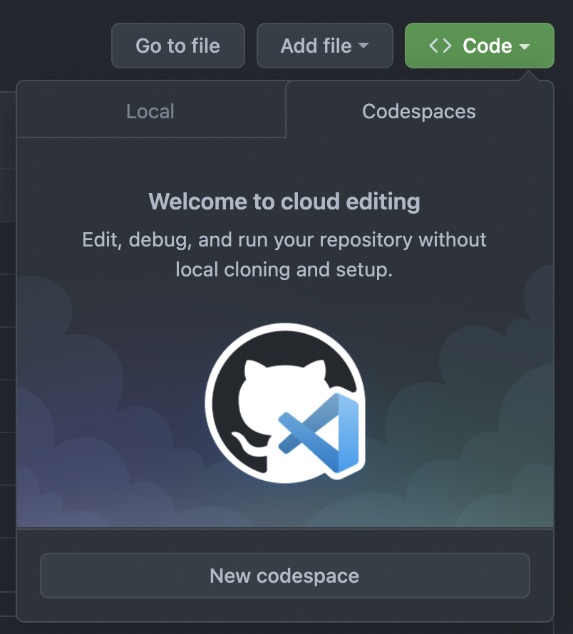
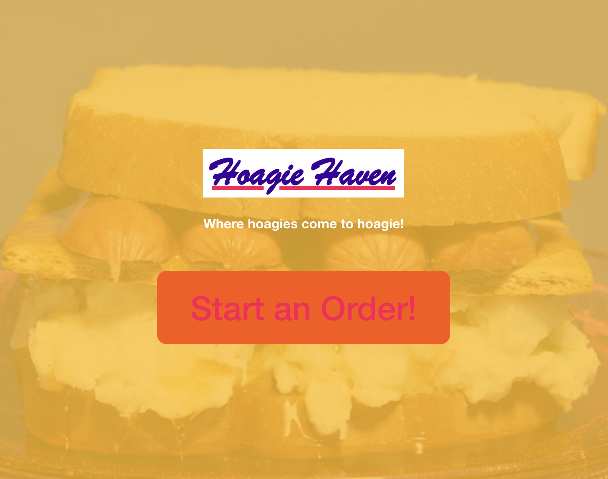
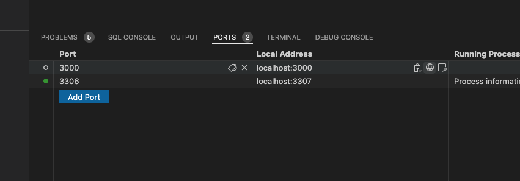

# Renew Home Engineering Assessment

### tldr;

**To get going right now:** In the Github UI, simply click the `Code` button, then select Codespaces and launch it.

> ‼️ While the codespace launches, come back and read the rest of this README

**If you are more comfortable with VS Code:** Once the codespace launches, you can install the **Github Codespaces Extension** (i.e. `GitHub.codespaces`) and connect to your codespace from your desktop environment, which maintains many of your local preferences (themes, snippets, and user preferences)

## About

1. This is a sample application with basic functionality for the purposes of assessing technical candidates only. Do not be concerned if there is code in this application which is imperfect or insecure, just focus on the tasks provided in the `Issues` section of the Github repository.
2. We expect the total time spent on the tasks in the `Issues` section not to exceed 3 hours; this is a _suggested_ limit to respect your time, and we are **not** monitoring your time usage. Feel free to break up your time spent working on this as fits your schedule, there is _no timer running_ ⏱

> We understand that the use of codespaces may imply that we're monitoring your progress/time; in reality, we chose to use codespaces simply for the ease of ensuring a quick setup time and a uniform environment.

3. It is not a deal-breaker if you do not get to everything. We do appreciate any and all context or psuedo-code for tasks which are incomplete, as that gives us a better understanding of how you would solve the problems presented if time allowed.
4. Write your code as if you were a team member working on a joint codebase with other developers, following good team-based development practices. Assume your fellow teammates have not seen the project requirements.
5. Test coverage is incredibly important to us, though as always, it is a work in progress. Follow campsite rules and leave things better than when you arrived.
6. Assume you are writing this code for a production environment where errors and edge cases should be handled gracefully.
7. Feel free to use Google and StackOverflow; after all, that is what we do every day in real-life programming. Feel free to do background research on a topic or library you encounter, and we hope that if nothing else, you are exposed to some new and interesting ideas through the process of completing this assessment.
8. Later steps of the interview process may involve code review or pair programming in this project, so be prepared to explain your thought process.

## 🏗 Getting set up

This repository is designed to work in Github's new **CodeSpaces** feature; this means you can have a virtually one-click environment setup with a browser- or VS Code-based editing experience. See the [Github docs on Codespaces](https://docs.github.com/en/codespaces/overview) for more information.

The easiest way to get going is to use the browser-based Visual Studio Code with codespaces; to access it:

- find the `<> Code` button at the top of the repository home page
- use it to open the flyout menu,
- select the `Codespaces` tab
- and click `New codespace`

> Codespaces will automatically switch to "idle" after 30 minutes of inactivity, but if you're done working, we appreciate you manually stopping the machine to conserve resources!

## 🏃 Once you're in: Running the server

### Backend Server (Python Flask)

You can run the Python/Flask API server by switching to the Debug pane ( &#8679;&#8984;D ) and starting the **Run Backend** debug config.

### Frontend Server (webpack dev server)

You can run the Webpack Hot Reload server by switching to the Debug pane ( &#8679;&#8984;D ) and starting the **Run Frontend** debug config. This will attempt to open a browser window with a debugger attached, but be advised this may or may not work well if you're using Codespaces in the browser. Occasionally the dev server becomes orphaned, and may be killed using the VS code task `npm:stop`.

You can also run `npm run start` from the `./frontend` directory to start the client dev server.

> There is a convenience debug configuration called `Run Frontend & Backend` which will run two separate debuggers with a single click. _Occasionally the webpack dev server starts up before the backend, so it may take a minute to actually load the app and make API calls_

### Accessing the running servers via Codespaces

Codespaces uses an automatic reverse proxy to expose your running application to you; when running from the console, you can `Command+click` (or `Ctl+click` on Windows) on any `http://localhost:####` URL printed in the console to open it through the reverse proxy.

You can also access the list of currently running ports in the codespace using the `Ports` tab in the bottom pane. By clicking on the small globe icon in the `Local Address` column, you may launch a new browswer window with the reverse-proxied url prepopulated (these icons are hover-only).

> When launching the backend, keep in mind there is no content at the `/` index route, so you'll get an HTTP error at the base URL. Simply add `/api/sandwiches` to see some content.

---

## ✅ Assessment Tasks

This repository has a few Github issues representing product-oriented enhancements and bugs. In order to respect your time, please complete as many tasks as you can, however _we do not expect you to finish all of the tasks_. We recommend you read through all of the tasks first and prioritize them according to those you feel most confident approaching, or which would show us the most about your abilities.

### For each issue, please **create a new branch and _draft_ PR** and perform all work in that branch. When you are finished with a task, mark the PR as _Ready for Review_

### Please prefix your branch name with `task-XXXX/`

where XXXX is the Task number specified in the body of the issue. As an example: task-1017/fix-styling would be a good option.

> There is no need to merge the PRs; next steps in the interview process will involve a code review with another engineer

---

## Backend Details

All files for the Python/Flask API server are contained in the `backend/` directory. This directory should be treated as the root for the python project (if you want to run these files in REPL you should `cd backend`)

> The API server runs on **Port 5000**

### Database Migrations

There are convenience VS Code tasks created to run Alembic migrations up and down, these can be accessed from the command pallette via `Tasks:Run Task`. You can also manually run migrations using `alembic` from the terminal.

The codespace environment runs MySQL in a separate container, but you can access it using either the pre-configured SQL Tools extension (cylinder icon in the left nav) or using `mysql` from the command line (host, user and password are preconfigured)

Our tests run in a separate database, which must be migrated separately: `hoagie_helper_test`. We provide tasks via `Tasks:Run Task` as above for the test DB, or you can set your `FLASK_ENV` to `test` and run `alembic` like so: `FLASK_ENV=test alembic upgrade heads`.

### Tests

Testing is handled by pytest, and can be run either using the VS Code Test Browser (the flask icon in the left nav), inline (using icons in the gutter next to test definitions) or by using `pytest` from the terminal.

> ⚠️ In some codespaces setups the VS Code Test Browser has not been appearing at startup (or appears without python tests). We have found that running the `Run Backend` debug task seems to kick the VS Code python plugin in the right way to get the test browser to work properly.
